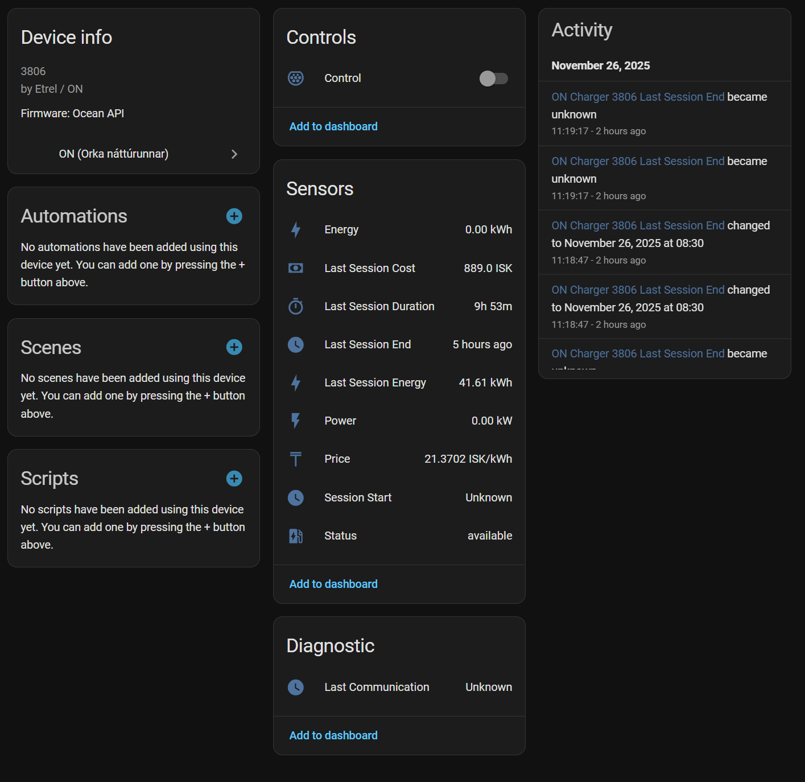

# ON (Orka náttúrunnar) for Home Assistant

Unofficial Home Assistant integration for the Icelandic [ON (Orka náttúrunnar)](https://on.is) EV charging network. 

Built for the **Etrel OCEAN** white-label platform.

## Features
*   **Home Charging:** Monitors your specific home charger status (Available, Preparing, Charging) even when idle.
*   **Live Monitoring:** Real-time Power (kW), Energy (kWh), and Price (ISK/kWh).
*   **History:** Tracks Cost, Energy, and Duration of the last completed session.
*   **Control:** Remote Start and Stop commands.
*   **Smart Logic:** Filters out neighbor chargers in shared garages and tries to handle poor connections to EVSEs.

## Installation

### Option 1: HACS (Recommended)
1.  Open **HACS** > **Integrations**.
2.  Click the **3 dots** (top right) > **Custom repositories**.
3.  Add this repository URL.
4.  Category: **Integration**.
5.  Search for **ON** and click **Download**.
6.  Restart Home Assistant.

### Option 2: Manual
1.  Copy the `custom_components/on_is` folder to your Home Assistant `config/custom_components/` directory.
2.  Restart Home Assistant.

## Configuration
1.  Go to **Settings** > **Devices & Services**.
2.  Click **Add Integration**.
3.  Search for **ON (Orka náttúrunnar)**.
4.  **Email / Password:** Enter your app credentials.
5.  **Home Charger QR Code (Recommended):** Enter the code printed on your charger (e.g., `IS*ONP...`).
    *   *Required for home chargers to appear when not charging.*
    *   *Used to filter out neighbors in shared garages.*

## Disclaimer
This is a reverse-engineered integration and is not affiliated with Orka náttúrunnar or Etrel. Use at your own risk.